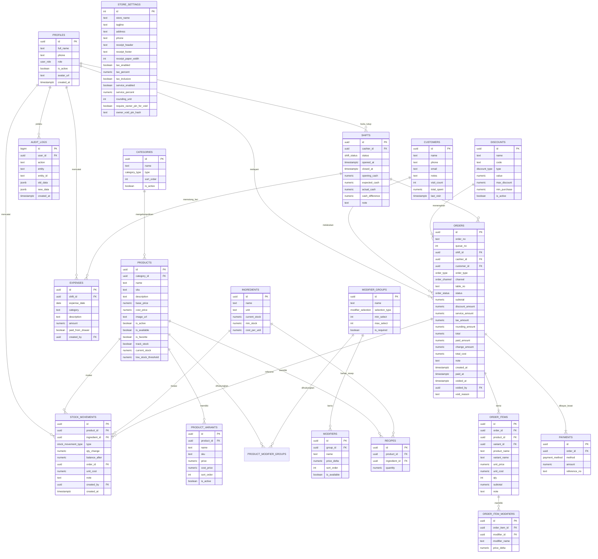

# ENTITY RELATIONSHIP DIAGRAM (ERD) — CHEESE DRINK POS

Dokumen ini memvisualisasikan seluruh skema basis data PostgreSQL Supabase yang digunakan oleh aplikasi kasir **Cheese Drink POS**.

---

## 1. Diagram Konseptual & Relasi (Mermaid)

---

## 2. Rincian Tipe Data Khusus (Postgres Enums)

1. **`user_role`**: `owner`, `cashier`.
2. **`order_type`**: `dine_in`, `take_away`, `delivery`.
3. **`order_channel`**: `walk_in`, `gofood`, `grabfood`, `shopeefood`, `whatsapp`, `other`.
4. **`order_status`**: `held`, `completed`, `void`.
5. **`payment_method`**: `cash`, `qris`, `bank_transfer`, `ewallet`, `other`.
6. **`discount_type`**: `percent`, `fixed`.
7. **`shift_status`**: `open`, `closed`.
8. **`stock_movement_type`**: `purchase`, `sale`, `sale_void`, `adjustment`, `waste`, `opening`.
9. **`category_type`**: `food`, `drink`, `other`.
10. **`modifier_selection`**: `single`, `multiple`.
